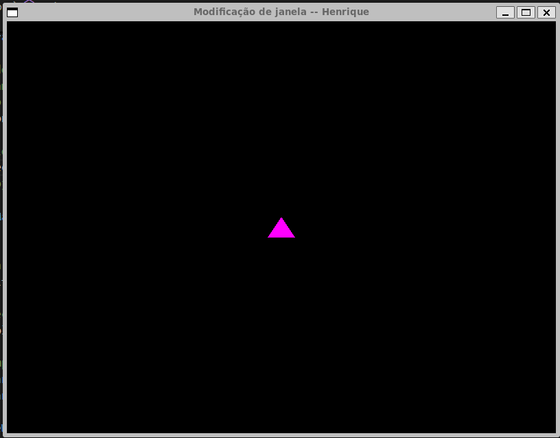

1. A janela do mundo fica bastante grande e nosso pequeno triângulo nem chega a aparecer na tela:

2. Nesse outro caso, a modificação da janela é diferente. As dimensões utilizam apenas o primeiro quadrante.