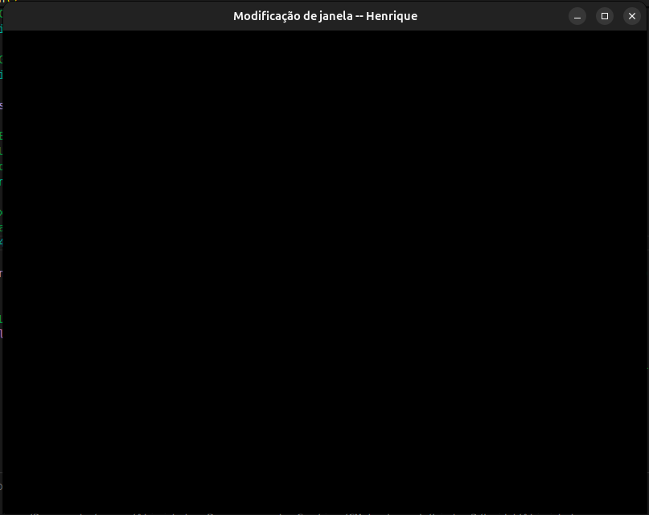
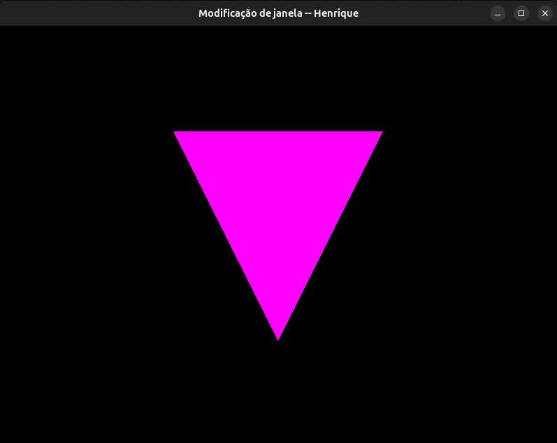
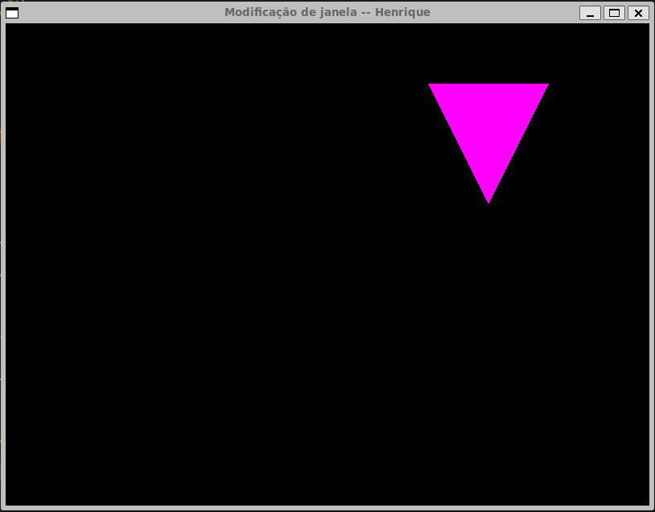
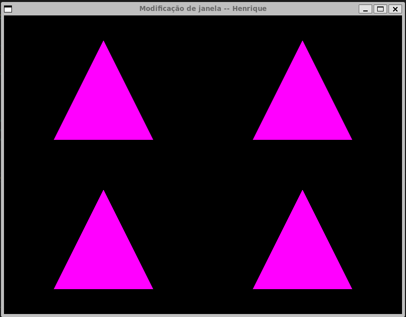

1. A janela do mundo fica bastante grande e nosso pequeno triângulo nem chega a aparecer na tela:

2. Nesse outro caso, a modificação da janela é diferente. As dimensões utilizam apenas o primeiro quadrante.
ortho(xmin=0, xmax=800, ymin600, ymin=0)

3. Quando o objeto é desenhado na tela, precisamos compensar o posicionamento da câmera e o objeto é mostrado de ponta cabeça.
Pelo fato dos pontos serem refletidos ao primeiro quadrante, temos um triângulo invertido.

4. A modificação de viewport necessitou mexer na declaração "glViewport" propriamente dita. Já que a janela precisava de sua origem deslocada.
A nova linha ficou da seguinte forma: "glViewport(width / 2, height / 2, width / 2, height / 2);"

5. A modificação da viewport do exercício anterior foi desfeita em favor de usar as tranformações do openGL para a disposição dos triângulos entre os quadrantes.
Com o use de "translates", é possível desenhar os mesmos vértices em pontos diferentes da tela.

